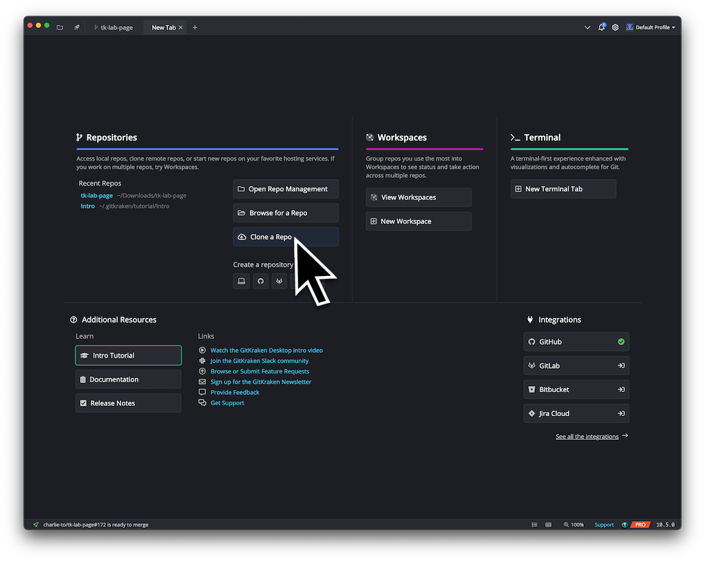
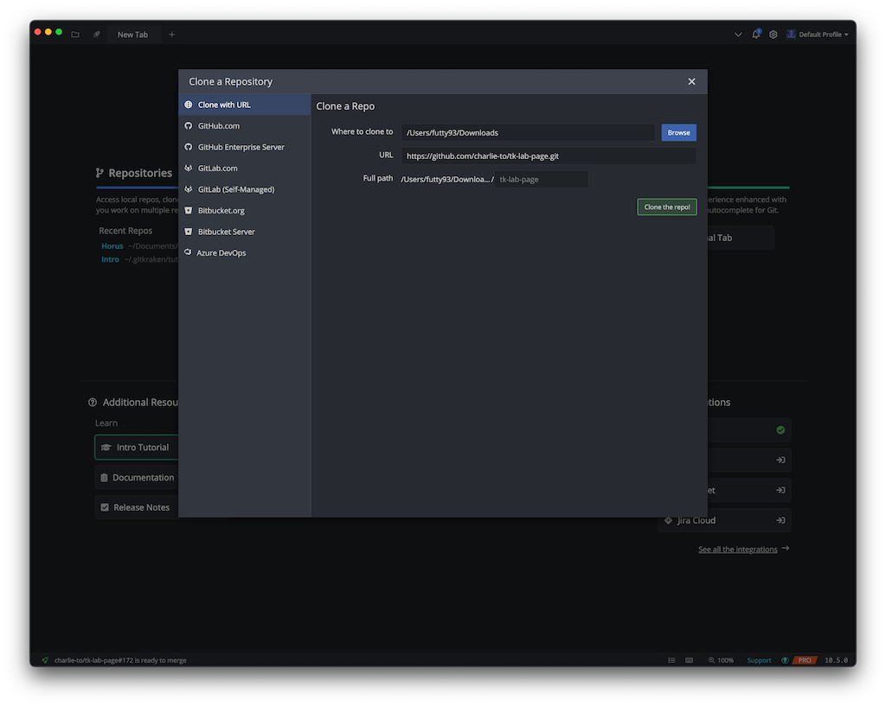
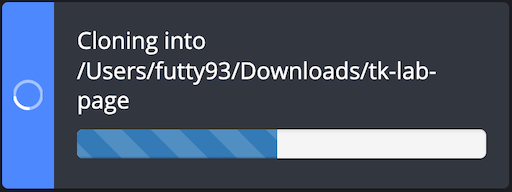

> [!CUSTOM] green report 作成中
> この記事は作成中です。研究室HPの更新方法を予定しています。

> [!CUSTOM] blue copilot はじめに
> 高橋・狩川研究室のホームページのソースコードはGitHubで管理されています。 自分のパソコンでソースコードを更新して、GitHubに反映する方法を説明します。 また、高橋狩川研究室のホームページ更新ではGitKrakenの利用を推奨しています。 このブログではGitKrakenを利用した方法を説明しますが、他の方法でGithubへ反映する方法を利用しても大丈夫です。

> [!NOTE]
> 高橋・狩川研究室のホームページのソースコードはGitHubで管理されています。 
> 自分のパソコンでソースコードを更新して、GitHubに反映する方法を説明します。 
> また、高橋狩川研究室のホームページ更新ではGitKrakenの利用を推奨しています。 
> このブログではGitKrakenを利用した方法を説明しますが、他の方法でGithubへ反映する方法を利用しても大丈夫です。

# GitKrakenのインストール
1. [GitKraken公式サイト](https://www.gitkraken.com/)にアクセスします。
2. ダウンロードページから、自分のOS（Windows、Mac、Linux）に合ったインストーラーをダウンロードします。
3. インストールウィザードに従ってインストールを完了させます。
  - インストール中にアカウント登録を求められる場合があります。GoogleアカウントやGitHubアカウントを使って登録すると簡単です。

---

# GitHubアカウントの作成
もしGitHubアカウントを持っていない場合は、以下の手順で作成してください。
1. [GitHub公式サイト](https://github.com/)にアクセスします。
2. 「Sign up」ボタンをクリックし、必要な情報（メールアドレス、パスワードなど）を入力してアカウントを作成します。

---

# 大元のリポジトリをフォーク
ホームページ管理係が管理している大元となるリポジトリを自分のGithubにフォーク(コピーを作成)します。
1. 大元のリポジトリをブラウザで開きます。(URL等はホームページ管理係に確認してください)
2. 画面右上部にあるForkをクリックします。

3. Create先のOwnerとして自分のアカウントを選択してください。
4. Create forkをクリックし、自分のリポジトリに`tk-lab-page`が追加されたことを確認してください。

---

# リポジトリのクローン
GitKrakenを使って研究室のホームページのソースコードを取得（クローン）します。
1. GitKrakenを起動します。
2. 左側のメニューから「Clone a Repo」を選択します。

3. 「Where to clone to」 に自分のパソコン内の保存したい場所を入力してください。
4. 「Repository URL」に、先ほど作成した`自分のGitHubリポジトリURL`を入力します。
  - 例: `https://github.com/username/tk-lab-page.git`

5. **`Create the repo!`** をクリック。
  - 左下にローディングが表示されるので、終わるまで待ちます。
  
6. クローンが完了したら、Open Nowをクリックします。Git KrakenにGRAPHが表示されたら完了です。

---

# GPGキーの設定
GitHubでは、セキュリティを向上させるためにGPGキーを利用することが推奨されています。ホームページ管理係でもGPGキーの登録を推奨しています。
1. [GitHubのGPGキーガイド](https://docs.github.com/en/authentication/managing-commit-signature-verification/generating-a-new-gpg-key)に従って、GPGキーを生成します。
2. 生成したGPGキーをGitHubのアカウント設定で登録します。
3. GitKrakenで設定する場合は、「Preferences > GPG Key」でキーを設定します。

---

# ブランチの作成
ホームページの変更作業を安全に行うために、新しいブランチを作成します。
1. GitKrakenの左側にある「Branch」アイコンをクリックします。
2. 「Create Branch」を選択し、ブランチ名を入力します。
  - 例: `feature/update-homepage`や`add-june-blog`.
3. 作成したブランチが選択された状態になっていることを確認します。

---

# ソースコードの編集とコミット
1. クローンしたローカルフォルダ内で、必要な変更を行います。
2. GitKrakenに戻り、変更が「Unstaged Changes」として表示されていることを確認します。
3. 必要なファイルを選択し、「Stage Changes」をクリックします。
4. 下部にあるメッセージ入力欄に、変更内容を記載して「Commit Changes」をクリックします。
  - 例: `Update navigation menu`や`Fix broken link on homepage`.

---

# プルリクエストの作成
1. GitKrakenの画面右上にある「Pull Request」をクリックします。
2. 「Open Pull Request」を選択し、変更内容を記載します。
3. 「Submit Pull Request」をクリックして、リポジトリの管理者にレビューを依頼します。

---

# プルリクエストのマージ
リポジトリ管理者がプルリクエストを確認し、問題がなければマージします。
1. GitHubのリポジトリページにアクセスします。
2. プルリクエストのタブを開き、該当するプルリクエストを選択します。
3. 「Merge Pull Request」ボタンをクリックして変更を反映します。

---

# ローカルリポジトリの更新
リモートリポジトリに変更が加わった場合、ローカルリポジトリを最新状態に更新します。
1. GitKrakenで、左上の「Pull」ボタンをクリックします。
2. 最新の状態が反映されることを確認します。

---

# トラブルシューティング（追加項目）
以下は、作業中に起こりうる問題とその解決方法です。
1. **コンフリクト（競合）が発生した場合**:
  - GitKrakenの「Conflict」ビューで競合箇所を確認し、適切に解決します。
2. **クローンやプッシュ時の認証エラー**:
  - GitHubアカウントの設定やSSHキーの設定を確認してください。

---

